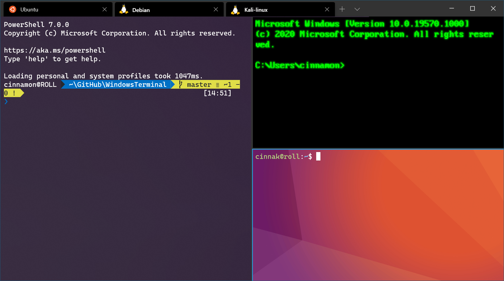

# WSL-ROS
Procedure to have a running ROS1/2 installation on Windows using WSL.


## Install WSL
In a powershell :
```bash
# Enable optional WSL feature in Windows

~$ dism.exe /online /enable-feature /featurename:Microsoft-Windows-Subsystem-Linux /all /norestart
```

WSL1 is now installed.

*TwinCAT does not work when Hyper-V is enabled. Because of this, WSL2 can't be used.* 

**WSL2**

Extra steps are needed to use WSL2. Enable virtualization :

```bash
~$ dism.exe /online /enable-feature /featurename:VirtualMachinePlatform /all /norestart

# You MUST restart your computer 
``` 
*Windows EDUCATION or PRO required. Does not work with Windows HOME.*

Don't forget to change your linux distro to wsl2 :
```bash
~$ wsl --list --verbose #list wsl distros
~$ wsl --set-version <distribution name> 2 #change a distro to WSL2
```
You can always downgrade/upgrade to the WSL version of your choice on the fly, without loss of data. 

## Install Linux Distro
Head over to the Windows Store and install your favorite Linux distro, e.g. Ubuntu 20.04 LTS.


## Install Windows Termianl (optional)
Follow this [link](https://learn.microsoft.com/en-us/windows/terminal/get-started).



## Setting GUI Forwarding

**Windows**

Install the Xserver `VcXsrv`. 

Add the windows [script](scripts/xserver-ros.bat) to the location of your choice. This will configure the Xserver correctly for ROS GUI's. 
An X icon will be added to the bottom right window. Hovering the icon, will give you the DISPLAY ID. E.g. `DESKTOP-59NOAGT:0.0`. 

To pin this script to the taskbar:
- Create a new Shortcut.
- Modify the Shortcut Target field with: `C:\Windows\System32\cmd.exe /k "C:\xserver-ros.bat"`
- Click Apply

 **Linux**
 
Export your Xserver Display ID. WLS should have written the DISPLAY ID to the `/etc/hosts` file.

```bash
# change your display id
~$ echo "export DISPLAY=DESKTOP-59NOAGT:0.0" >> ~/.bashrc

~$ source ~/.bashrc
```

## Install ROS1
Be sure to install ROS-Noetic with the Ubuntu 20.04 LTS WSL.
Follow the installation [tutorial](http://wiki.ros.org/noetic/Installation/Ubuntu) and choose the `Desktop-Full` ROS installation.

**RViz**
You might run into this error when running RViz :
```bash
~$ rviz
rviz: error while loading shared libraries: libQt5Core.so.5: cannot open shared object file: No such file or directory

# Solution
~$ sudo strip --remove-section=.note.ABI-tag /usr/lib/x86_64-linux-gnu/libQt5Core.so.5
```

If everything is well configured, you should see the RViz GUI forwarded to Windows !

## Install ROS2
Be sure to install ROS2-Humble with the Ubuntu 22.04 LTS WSL.
Follow the installation [tutorial](http://wiki.ros.org/noetic/Installation/Ubuntu) and choose the `Desktop-Full` ROS installation.

After the installation, try opening a GUI interface, e.g. rqt or rviz2.
If everything is well configured, you should see the RViz2 GUI forwarded to Windows !

## Sources
[jackkawell wordpress](https://jackkawell.wordpress.com/2020/06/12/ros-wsl2/)<br />
[learn.microsoft.com](https://learn.microsoft.com/en-us/windows/wsl/install-manual)
